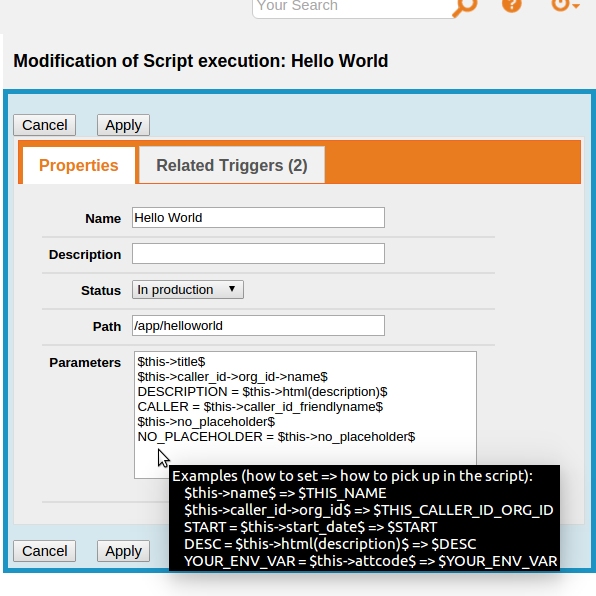
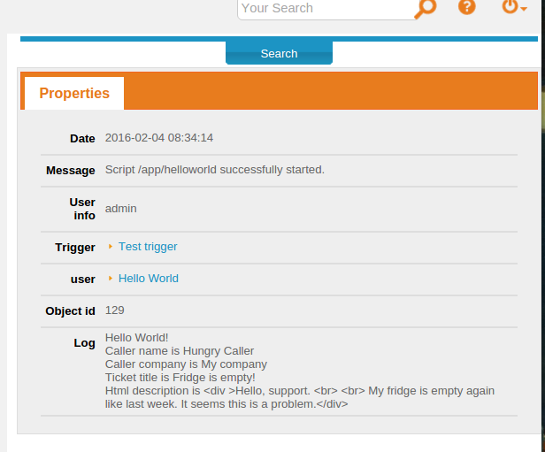
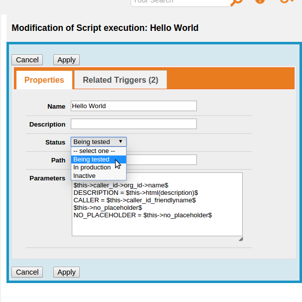
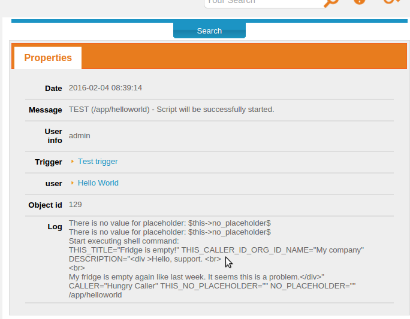

# action-shell-exec

## Action shell script execution for Combodo iTop

##### Описание на русском здесь: http://community.itop-itsm.ru/t/modul-zapuska-shell-skriptov/303.

Can be used in linux.

1. Install like any other extension. 
   - Copy the action-shell-exec to itop/extensions folder and go to http://localhost/setup/. 
   - Select "Upgrade an existing iTop instance" and follow the wizard.
  
2. Create a new action and link it with triggers. See example below how to pass parameters to the script.
   **Using user data in a Shell script potentially not secure!**

  
  
3. The script output will be written to the notification log (see "Notifications" tab in the target object).

  

4. Use "Being tested" status in the action and check the notification log to find errors and the command that will be executed.

  
  

### Links
- [iTop ITSM & CMDB по-русски](http://community.itop-itsm.ru)
- [Combodo iTop](http://www.combodo.com/itop)

## demo
demo script(shell)

```
#!/bin/bash
d=`cd $(dirname $0);pwd`
cd $d
ds=`date +%Y%m%d-%H%M%S`

echo "$ds  $THIS_NAME - $THIS_HOSTNAME"
echo "$ds  $THIS_NAME - $THIS_HOSTNAME" >> demo.log
```

demo script(php). 需要读取环境变量

```
#!/usr/bin/php
<?
$THIS_HOSTNAME = getenv("THIS_HOSTNAME");
$THIS_NAME = getenv("THIS_NAME");
echo "$THIS_HOSTNAME $THIS_NAME";
?>
```

