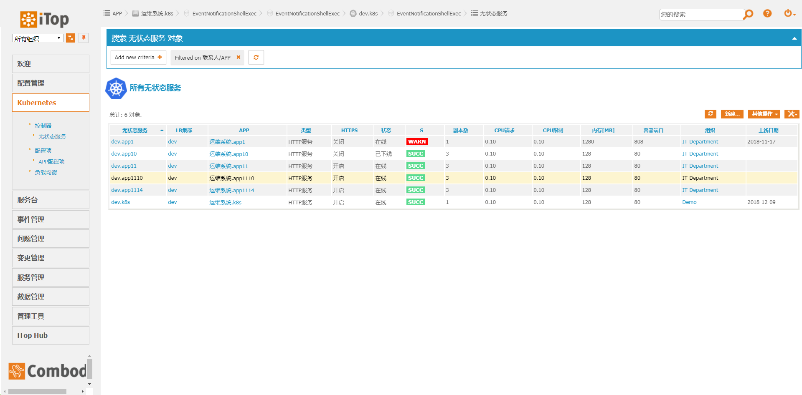
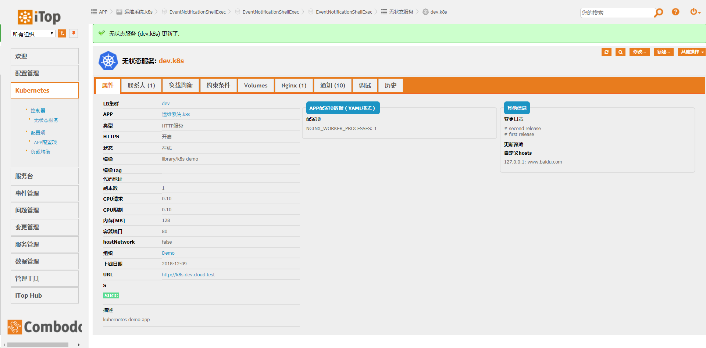
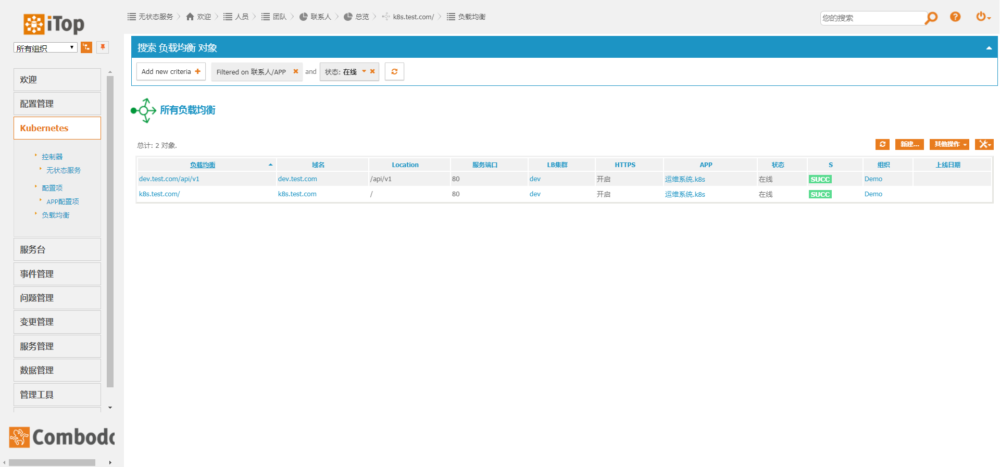
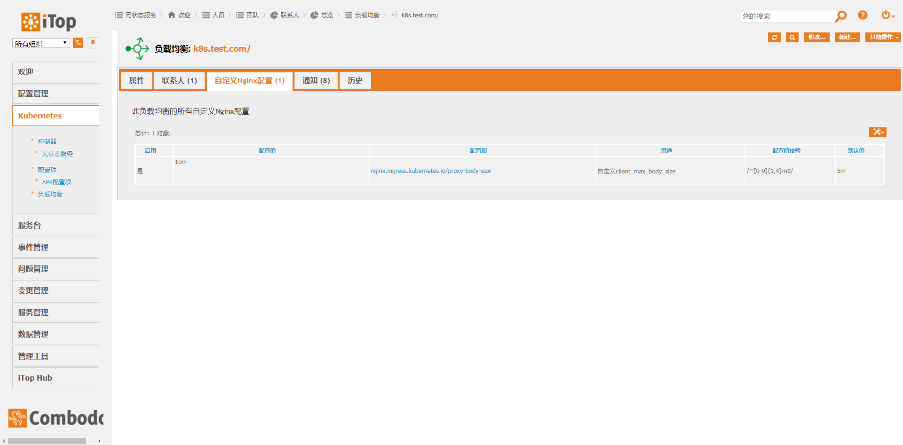

# kubernetes
利用`iTop`完善的`CMDB`功能管理`Kubernetes`对象，相比于`yaml`定义`Kubernetes`对象，具有以下特点
- 用户仅需具备基本的docker容器经验即可使用kubernetes，无需专门学习kubernetes
- 资源唯一性校验，保证app名称，域名等不会冲突
- 利用`iTop`的lnk类型，直观的实现nginx配置，volume挂载，affinity等功能，用户可以直接勾选
- 利用`lifecycle`，实现业务更新、下线等操作。并且天然支持批量操作。适合于灾难恢复场景下快速批量上线大量业务
- 权限控制，用户只能部署自己名下的`APP`相关资源，只能看到自己名下`APP`的`secret`内容
- 嵌入kubernetes dashboard，供用户调试使用

## 预览
Deployment列表


Deployment详情页


Ingress列表


自定义nginx配置页


嵌入dashboard


## 工作原理
iTop对象创建或删除时触发动作执行脚本，脚本中调用Kubernetes API应用iTop中的更新

触发器需要安装插件 annProg/itop-extensions/knowitop-trigger-on-update

自定义动作需要安装插件 annProg/itop-extensions/action-shell-exec

## 触发器配置

TriggerOnCreate
```
"描述","类别","目标类","过滤器"
"Kubernetes对象创建","触发器 (对象创建时)","Kubernetes","SELECT Kubernetes"
```

TriggerOnObjectUpdate
```
"描述","类别","目标类","Tracked attributes","过滤器"
"Kubernetes对象更新","Trigger on object update","Kubernetes","","SELECT Kubernetes"
```

两个触发器均链接以下动作:

```
"名称","类别","名称","描述","状态","Path","Parameters"
"Kubernetes","Script execution","Kubernetes","Kubernetes对象操作","生产中","/home/wwwroot/default/cmdb/cmdbApi/actions/demo.sh","SCRIPT_NAME=kubernetes.php\nID=$this->id$"
```

动作脚本参见 https://github.com/annProg/cmdbApi/tree/master/actions

