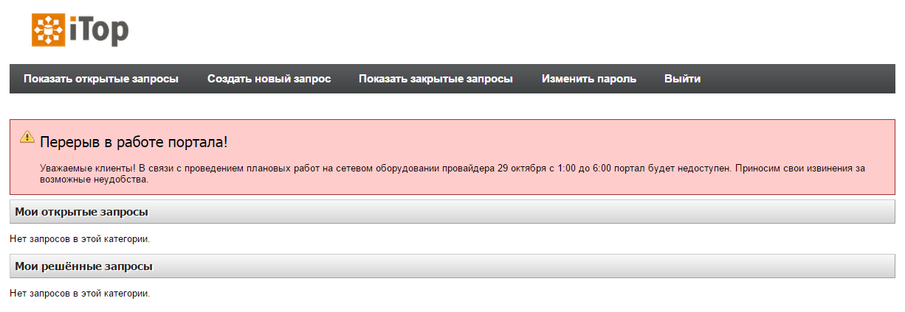
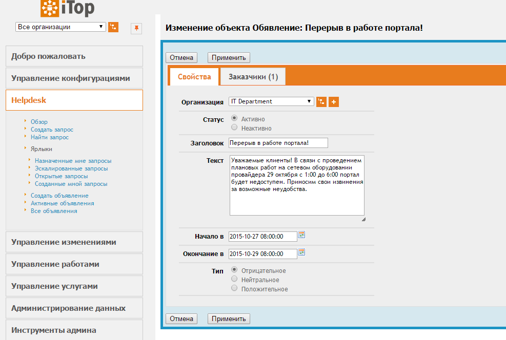

# portal-announcement (ru)
## Объявления для пользователей портала Combodo iTop

Модуль позволяет создавать объявления и информационные сообщения для пользователей клиентского портала.



Для объявления можно выбрать стилистическое оформление, период показа и заказчиков, сотрудники которых увидят объявление. Если период показа не задан, объявление будет отображаться постоянно. Объявление не отображается, если не выбран ни один заказчик.



### Установка

Установка производится в два этапа.

###### Установка модуля:
 1. Перекладываем папку *portal-announcement* в *itop/extensions/*.
 2. Разрешаем редактирование config-файла iTop *itop/conf/production/config-itop.php*.
 3. Переходим в браузере http://my-itop/setup и выбираем "Upgrade an existing iTop instance".
 4. На предпоследнем шаге ставим галочку напротив названия модуля и устанавливаем.
 5. Готово.
 
###### Добавление вывода объявления `itop/portal/index.php`:
Нужно вставить `Announcement::DisplayAnnouncement($oP);` в 1320 строку файла *itop/portal/index.php*:
````
1315  ...
1316  $oP = new PortalWebPage(Dict::S('Portal:Title'), $sAlternateStylesheet);
1317
1318  $oP->EnableDisconnectButton(utils::CanLogOff());
1319  $oP->SetWelcomeMessage(Dict::Format('Portal:WelcomeUserOrg', UserRights::GetUserFriendlyName(), $oUserOrg->GetName()));
1320  Announcement::DisplayAnnouncement($oP);
1321  if (is_object($oUserOrg))
1322  {
1323    switch($sOperation)
1324	...
````

Примечание: номер строки 1320 указан для версии iTop 2.2 и в других версиях может отличаться.

### Ссылки
- [iTop ITSM & CMDB по-русски](http://community.itop-itsm.ru)
- [Сайт Combodo iTop](http://www.combodo.com/itop)
